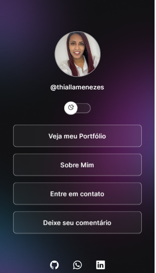
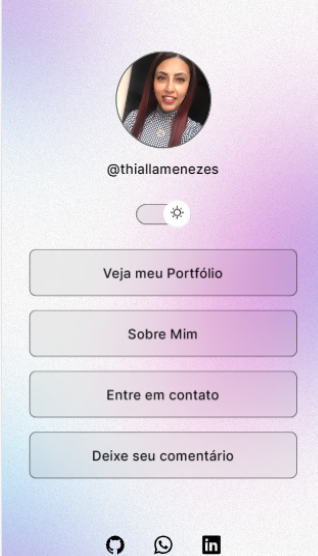

# Página de links

## 💻 Sobre o projeto:

O objetivo do projeto era criar uma página para acesso aos links, tendo a possibilidade de escolher o modelo de visualização na versão light ou dark, e conforme alteração de tema também ocorre alteração na imagem.

## 🔗Link do projeto:

https://thmenezes.github.io/loginDark/

## Tecnologias:

## Autora:

  https://github.com/ThMenezes

